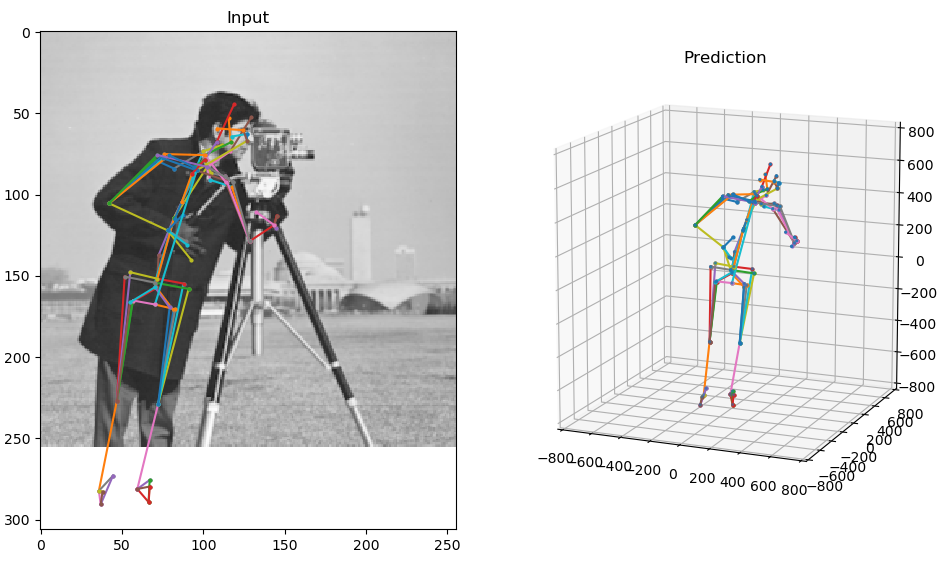

# MeTRAbs: Metric-Scale Truncation-Robust Heatmaps for Absolute 3D Human Pose Estimation

Paper: https://arxiv.org/abs/2007.07227

## News:
  * Our method has won the **[3DPW Challenge](https://virtualhumans.mpi-inf.mpg.de/3DPW_Challenge/)** at ECCV2020!

## Inference

1. Download the model file from [metrabs_3dpw_chall_model.pb](https://omnomnom.vision.rwth-aachen.de/data/metrabs/metrabs_3dpw_chall_model.pb).
2. Run the example inference script as: `./inference.py --model-path=metrabs_3dpw_chall_model.pb`

## Training

Coming soon!
