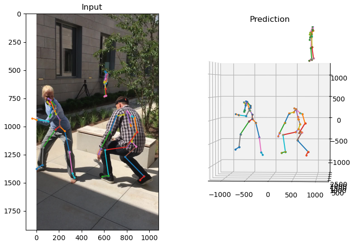

# MeTRAbs Absolute 3D Pose Estimator



[](https://youtu.be/BemM8-Lx47g)

* Paper: https://arxiv.org/abs/2007.07227
* Video: https://youtu.be/BemM8-Lx47g

**MeTRAbs: Metric-Scale Truncation-Robust Heatmaps for Absolute 3D Human Pose Estimation** <br>
**by István Sárándi, Timm Linder, Kai O. Arras, Bastian Leibe** <br>
RWTH Aachen University, Robert Bosch GmbH

To appear in: IEEE Transactions on Biometrics, Behavior, and Identity Science (T-BIOM), Selected Best Works From Automated Face and Gesture Recognition 2020 


Please cite as 

```bibtex
@article{Sarandi20TBIOM,
  title={{MeTRAbs:} Metric-Scale Truncation-Robust Heatmaps for Absolute 3{D} Human Pose Estimation},
  author={S\'ar\'andi, Istv\'an and Linder, Timm and Arras, Kai O. and Leibe, Bastian},
  journal={IEEE Transactions on Biometrics, Behavior, and Identity Science},
  note={in press}
}
```

## News
  * Training and evaluation code is now available along with dataset pre-processing scripts!
  * Our method has won the **[3DPW Challenge](https://virtualhumans.mpi-inf.mpg.de/3DPW_Challenge/)** at ECCV2020!
   
## Inference Code
To allow easy application in downstream research, we package our models in a way that requires
nothing more than a TensorFlow 2 installation and inference is just a single line of Python. 

Download the model(s) and try `./demo.py` as follows:

```bash
wget https://omnomnom.vision.rwth-aachen.de/data/metrabs/metrabs_singleperson_smpl.zip -P ./models
wget https://omnomnom.vision.rwth-aachen.de/data/metrabs/metrabs_multiperson_smpl.zip -P ./models
wget https://omnomnom.vision.rwth-aachen.de/data/metrabs/metrabs_multiperson_smpl_combined.zip -P ./models
unzip models/*.zip -d ./models
./demo.py
```

MeTRAbs, at its core, is based on single-person pose estimation and it is extended to multi-person applications by 
first detecting people and then running the single-person estimation for each of them. This so-called top-down multiperson 
strategy is already (quite efficiently) packaged into a standalone model for convenience. This multiperson extension
also takes into account the implicit rotation that cropping induces. Instead of naive cropping, this model takes care
of applying the appropriate homography transformation for perspective undistortion and returns the poses in the correct
camera coordinate frame. The models also contain built-in capability for test-time augmentation
(transforming each crop multiple times and averaging the results).

### Case 1: No bounding boxes (and maybe unknown intrinsics)
If you just have an image and know nothing else, you can run the combined model, which includes a baked-in YOLOv4 detector (based on https://github.com/hunglc007/tensorflow-yolov4-tflite).
If the intrinsic matrix is not given, it is automatically assumed that the angle of view is 50 degrees, which is roughly appropriate for consumer cameras.
(Provide the true intrinsics for more accurate results.)

```python
import tensorflow as tf
model = tf.saved_model.load('./models/metrabs_multiperson_smpl_combined')
image = tf.image.decode_jpeg(tf.io.read_file('./test_image_3dpw.jpg'))
detections, poses3d, poses2d = model.predict_single_image(image)
```

### Case 2: Known bounding boxes and intrinsics
If you want to feed the bounding boxes yourself, you can do that as well with the basic multiperson model:

```python
import tensorflow as tf
model = tf.saved_model.load('./models/metrabs_multiperson_smpl')
image = tf.image.decode_jpeg(tf.io.read_file('./test_image_3dpw.jpg'))
intrinsics = tf.constant([[1962, 0, 540], [0, 1969, 960], [0, 0, 1]], dtype=tf.float32)
# Boxes are represented in [left, top, width, height] order
person_boxes = tf.constant([[0, 626, 367, 896], [524, 707, 475, 841], [588, 512, 54, 198]], tf.float32)
poses3d = model.predict_single_image(image, intrinsics, person_boxes)
```

To predict multiple images at once, use the `predict_multi_image` methods. In this case the bounding boxes
are supplied in a tf.RaggedTensor, since each image in a batch may contain a different number of detections.

In any case, the individual crops are automatically batched up behind the scenes and sent to the 
single-person pose estimator in that batched form.


## Training

Make sure to [install the dependencies](DEPENDENCIES.md) and [prepare the datasets](DATASETS.md)
 first (mind the licenses, some/most data is restricted to academic research), then you can train the models. Here are a few example configurations
 (append `--gui` to see visualizations):

### MeTRo

```bash
$ cd src
$ ./main.py \
    --train --dataset=h36m --train-on=trainval --epochs=27 --seed=1 \
    --logdir=h36m/metro_seed1

$ ./main.py \
    --train --dataset=h36m --train-on=trainval --epochs=27 --seed=1 \
    --scale-recovery=bone-lengths --logdir=h36m/2.5d_seed1

$ ./main.py \
    --train --dataset=mpi-inf-3dhp --train-on=trainval --epochs=27 --seed=1 \
    --background-aug-prob=0.7 --universal-skeleton --logdir=3dhp/metro_univ_seed1

$ ./main.py \
    --train --dataset=mpi-inf-3dhp --train-on=trainval --epochs=27 --seed=1 \
    --background-aug-prob=0.7 --no-universal-skeleton --logdir=3dhp/metro_nonuniv_seed1
```

### MeTRAbs

```bash
$ ./main.py \
    --train --dataset=muco-17-150k --dataset2d=mpii-yolo --scale-recovery=metrabs \
    --epochs=24 --seed=1 --background-aug-prob=0.7 --occlude-aug-prob=0.3 \ 
    --stride-test=32 --logdir=muco/metrabs_univ_seed1 --universal-skeleton
```

## Evaluation

To compute benchmark evaluation metrics, we first need to produce predictions on test data,
 then we run the evaluation script on the prediction results.
 For example:

```bash
$ CHECKPOINT_DIR="$DATA_ROOT/experiments/h36m/someconfig"
$ ./main.py --test --dataset=h36m --stride-test=4 --checkpoint-dir="$CHECKPOINT_DIR"
$ python -m scripts.eval_h36m --pred-path="$CHECKPOINT_DIR/predictions_h36m.npz"
```

```bash
$ CHECKPOINT_DIR="$DATA_ROOT/experiments/3dhp/someconfig"
$ ./main.py --test --dataset=mpi-inf-3dhp --stride-test=4 --checkpoint-dir="$CHECKPOINT_DIR"
$ python -m scripts.eval_3dhp --pred-path="$CHECKPOINT_DIR/predictions_mpi-inf-3dhp.npz"
```

```bash
$ CHECKPOINT_DIR="$DATA_ROOT/experiments/muco/someconfig"
$ ./main.py --test --dataset=mupots --scale-recovery=metrabs --stride-test=32 --checkpoint-dir="$CHECKPOINT_DIR"
$ python -m scripts.eval_mupots --pred-path="$CHECKPOINT_DIR/predictions_mupots.npz"
```

The first command in each case creates the file `$CHECKPOINT_DIR/predictions_$DATASET.npz`.

Note: the script `eval_mupots.py` was designed and tested to produce the same results as Mehta et al.'s official MuPoTS Matlab evaluation script. 
 However, this Python version is much faster and computes several different variations of the evaluation metrics at the same time 
 (only matched or all annotations, root relative or absolute, universal or metric-scale, bone rescaling, number of joints).

To evaluate and average over multiple random seeds:

```bash
$ for s in {1..5}; do ./main.py --train --test --dataset=h36m --train-on=trainval --epochs=27 --seed=$i --logdir=h36m/metro_seed$i; done
$ python -m scripts.eval_h36m --pred-path="h36m/metro_seed1/predictions_h36m.npz" --seeds=5
```

## Packaging Models

We first export a single-person TensorFlow SavedModel that operates on batches of 256x256 px image crops directly:

```bash
$ CHECKPOINT_DIR="$DATA_ROOT/experiments/muco/someconfig"
$ ./main.py --scale-recovery=metrabs --dataset=mupots --checkpoint-dir="$CHECKPOINT_DIR" --export-file="$CHECKPOINT_DIR"/metrabs_mupots_singleperson --data-format=NHWC --stride-train=32 --stride-test=32
```

Then we build a multiperson model which takes full images and multiple bounding boxes per image as arguments: 

```bash
$ python -m scripts.build_multiperson_model --input-model-path="$CHECKPOINT_DIR"/metrabs_mupots_singleperson --output-model-path="$CHECKPOINT_DIR"/metrabs_mupots_multiperson
```

We can also build a combined detector + pose estimator model as follows: 

```bash
$ python -m scripts.build_combined_model --input-model-path="$CHECKPOINT_DIR"/metrabs_mupots_multiperson --detector-path=./yolov4 --output-model-path="$CHECKPOINT_DIR"/metrabs_mupots_multiperson_combined
```

## 3DPW Inference

To generate results on 3DPW and evaluate them, run

```bash
$ python -m scripts.video_inference --gt-assoc --dataset=3dpw --detector-path=./yolov4 --model-path=models/metrabs_multiperson_smpl --crops=5 --output-dir=./3dpw_predictions 
$ python -m scripts.eval_3dpw --pred-path=./3dpw_predictions
```
